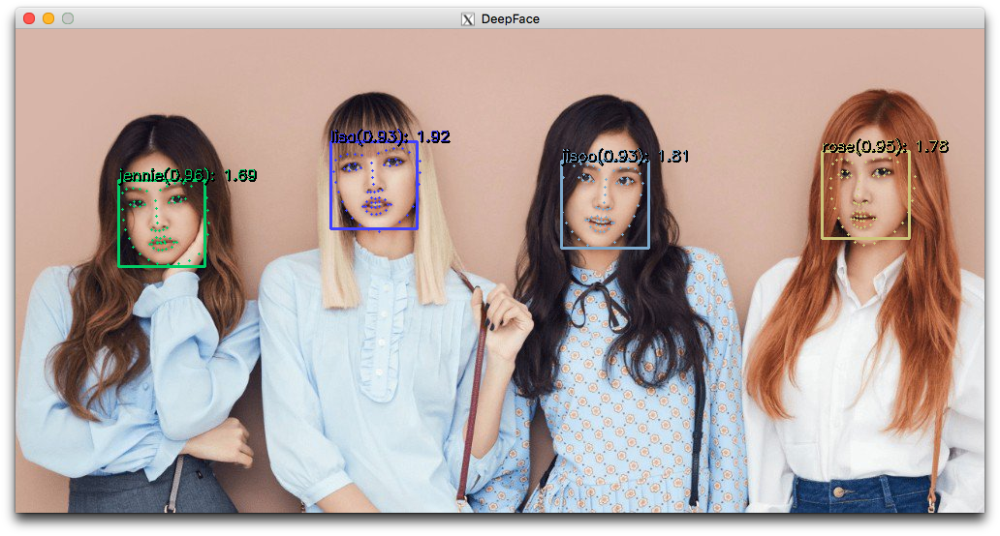

# deepface



Deep Learning Models for Face Detection/Recognition/Alignments, implemented in Tensorflow.

It is being implemented...

## Models

### Baseline

A baseline model use dlib face detection module to crop rois. Then they will be forwarded at the vggface network to extract features.

- dlib face detection
- dlib face alignment
- VGGFace face recognition

## Experiments

### LFW Dataset

| Model                                 | Set        | 1-EER      |
|---------------------------------------|------------|------------|
| VGG(Paper, No Embedding, Trained)     | Test       | 0.9673     |
| VGG(Paper, Embedding, Trained)        | Test       | 0.9913     |
|                                       |            |            |
| VGG(no embedding, no training on lfw) | Test       | 0.9400     |

## Install

### Requirements

- tensorflow >= 1.8.0
- opencv >= 3.4.1

### Install & Download Models

```bash
$ pip install -r requirements.txt
$ cd detectors/dlib
$ bash download.sh
$ cd ../../recognizers/vggface/
$ bash download.sh
```

## Run

### Test on samples

```bash
$ python3 deepface.py save_and_run --path=./samples/faces
```

### Test on a image

```bash
$ python3 deepface.py run --visualize=true --image=./samples/blackpink/blackpink1.jpg
```

## Reference

### Models

[1] VGG Face : http://www.robots.ox.ac.uk/~vgg/software/vgg_face/

[2] VGG Face in Tensorflow : https://github.com/ZZUTK/Tensorflow-VGG-face

[3] DLib : https://github.com/davisking/dlib

[4] Dlib Guide Blog : https://www.pyimagesearch.com/2017/04/03/facial-landmarks-dlib-opencv-python/

### Datasets

[1] LFW : http://vis-www.cs.umass.edu/lfw/